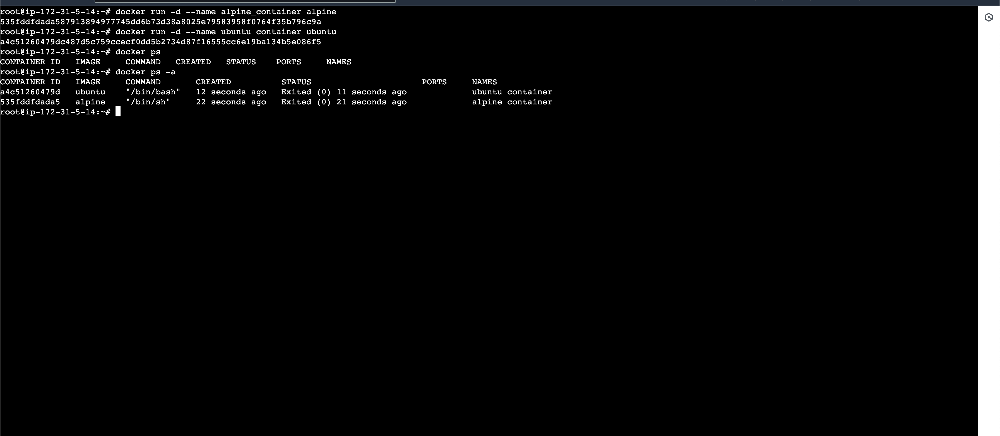
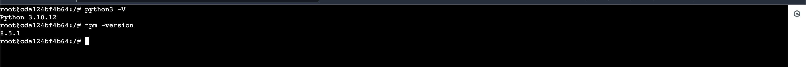

# Docker Assignment 1

## Containerization 
This is a method of software deployment process that bundles application's code and its dependencies required for the application to run on any infrastructure both in the cloud and on-premise.

##  Benefit Of Containerization
Some major benefit of using containerization method in deployment of an application include the following:
+   Portability
+   Scalability
+   Fault tolerance and
+   Agility


##  Docker
Docker is an open source containerization tool launched in 2008 that helps build, test and deploy containerized application/software faster and efficiently.

## Walk through on how to install and run docker containers
To install docker on an environment, the requirement is to have 64-bit version of one of these Ubuntu versions
+   a.  Ubuntu Mantic 23.10
+   b.  Ubuntu Jammy 22.04 (LTS)
+   c.  Ubuntu Focal 20.04 (LTS)


For this demonstration i will be making use of Amazon Web Service (AWS) EC2 Ubuntu Jammy 22.04 (LTS) using the apt repository.
+   After the launch of an EC2 Ubuntu 22.04 (LTS) on AWS, we need to login into the instance using SSh commnd or the use of Putty.

        ssh -i <key_name> remote_username@remote_host

+   Installing docker for the first time on a new machine requires the need of setting up the docker repository. After which wee can install and update docker from the repository

    +   Set up Docker's apt repository by running the below command

                # Add Docker's official GPG key:
                sudo apt-get update
                sudo apt-get install ca-certificates curl
                sudo install -m 0755 -d /etc/apt/keyrings
                sudo curl -fsSL https://download.docker.com/linux/ubuntu/gpg -o /etc/apt/keyrings/docker.asc
                sudo chmod a+r /etc/apt/keyrings/docker.asc

                # Add the repository to Apt sources:
                echo \
                "deb [arch=$(dpkg --print-architecture) signed-by=/etc/apt/keyrings/docker.asc] https://download.docker.com/linux/ubuntu \
                $(. /etc/os-release && echo "$VERSION_CODENAME") stable" | \
                sudo tee /etc/apt/sources.list.d/docker.list > /dev/null
                sudo apt-get update                

    +   Install the Docker packages. To install the latest version of docker run:

                sudo apt-get install docker-ce docker-ce-cli containerd.io docker-buildx-plugin docker-compose-plugin -y

    +   Now, let us verify if the docker was installed and to get the docker version installed in the ubuntu
        +   Additionally let's have the root privilege to run our docker commands

                    sudo -i

        +   For the version detals run:

                    docker -V
            
            
        
        +   To get Docker service status run:

                    systemctl status docker
            
            
    
+   Running ubuntu and alpine docker images in forground
    +   Ubuntu image

                # Run ubuntu container in foreground
                docker run --rm -it ubuntu
        
    +   alpine image

                # Run alpine container in foreground
                docker run --rm -it alpine
        

+   Running ubuntu and alpine docker images in background
    +   Ubuntu image

                # Run alpine container in background
                docker run -d --name alpine_container alpine
    +   alpine image  

                # Run ubuntu container in background
                docker run -d --name ubuntu_container ubuntu
        

+   Installing Python3 and npm in both the alpine and ubuntu containers
    +   ubuntu container: Run the following command

                # Start the container
                docker run -dit ubuntu

                #   Ge the container ID
                docker ps

                # Attach to the container's shell
                docker exec -it <container-Id> /bin/bash

                # Update package index
                apt update

                # Install Python 3 and npm
                apt install -y python3 npm

                # verify if python3 and npm are installed
                python3 -V
                npm –version
        

    +   alpine container: Run the following command

                # Start the container
                docker run -dit alpine

                # Get the container ID
                docker ps

                # Attach to the container's shell
                docker exec -it <container-Id> sh

                # Update package index
                apk update

                # Install Python 3 and npm
                apk add python3 npm

                # Verify if Python 3 and npm are installed
                python3 -V
                npm --version
        

+   To view images associated with the docker containers, we run

            docker images
    

### Extra
+ Some important docker command includes:

1. **docker run**: This command is used to create and start a new container from an image.

    Example:
    ```bash
    docker run -it --rm ubuntu
    ```

2. **docker ps**: This command lists all running containers.

    Example:
    ```bash
    docker ps
    ```

3. **docker images**: This command lists all Docker images available on your system.

    Example:
    ```bash
    docker images
    ```

4. **docker build**: This command is used to build a Docker image from a Dockerfile.

    Example:
    ```bash
    docker build -t my_image .
    ```

5. **docker stop**: This command is used to stop one or more running containers.

    Example:
    ```bash
    docker stop my_container
    ```

6. **docker start**: This command is used to start one or more stopped containers.

    Example:
    ```bash
    docker start my_container
    ```

7. **docker exec**: This command is used to execute a command inside a running container.

    Example:
    ```bash
    docker exec -it my_container bash
    ```

8. **docker rm**: This command is used to remove one or more stopped containers.

    Example:
    ```bash
    docker rm my_container
    ```

9. **docker rmi**: This command is used to remove one or more Docker images.

    Example:
    ```bash
    docker rmi my_image
    ```

10. **docker-compose**: This command is used to define and run multi-container Docker applications.

    Example:
    ```bash
    docker-compose up -d
    ```

